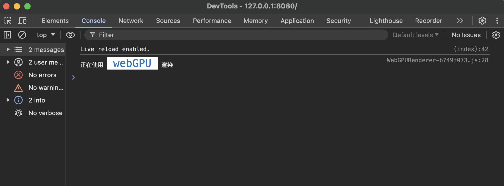

# 简介

这是一个canvas2D渲染引擎，支持WebGPU、WebGL、Canvas2D三种渲染方式，并且可以无缝切换，其API命名跟pixijs version 7类似。主要的代码放在src/lib下，其余的代码都是一些测试代码。

# 启动项目

```bash
yarn start
```

# 快速开始

```typescript
// 新建一个应用
// 首先需要有一个canvas元素
const view = document.getElementById('canvas') as HTMLCanvasElement

// new一个Application
const app = new Application({
  // 指定canvas元素
  view,
  // 指定背景颜色以及背景的透明度
  backgroundColor: '#aaaaaa',
  backgroundAlpha: 0.1
})

// 需要执行init函数后才会开始渲染
app.init().then(() => {
  // 添加一个红色的矩形
  const redRect = new Graphics().beginFill('red').drawRect(400, 300, 200, 200)
  redRect.cursor = 'pointer'
  app.stage.addChild(redRect)

  // 添加一个绿色的圆
  const greenCircle = new Graphics()
    .beginFill('green')
    .drawCircle(200, 400, 150)
  greenCircle.cursor = 'pointer' // 添加指针悬浮效果
  app.stage.addChild(greenCircle)

  // 添加一个蓝色的多边形
  const bluePoly = new Graphics()
    .beginFill('blue', 0.7)
    .moveTo(100, 200)
    .lineTo(400, 100)
    .lineTo(1000, 300)
    .lineTo(900, 600)
    .lineTo(800, 400)
    .closePath()
  bluePoly.cursor = 'pointer'
  app.stage.addChild(bluePoly)
})
```

然后就能在屏幕上看到效果了！

# 添加图片(sprite)

```typescript
appRef.current?.init().then(() => {
  const img1 = new Image()
  img1.src = dogImg
  img1.onload = () => {
    const texture = Texture.from(img1)
    const sprite = new Sprite(texture)
    sprite.width = 200
    sprite.height = 200
    appRef.current?.stage.addChild(sprite)
  }

  const img2 = new Image()
  img2.src = seaImg
  img2.onload = () => {
    const sprite = Sprite.from(img2)
    sprite.width = 300
    sprite.height = 300
    sprite.position.set(0, 300)
    sprite.alpha = 0.7
    appRef.current?.stage.addChild(sprite)
  }

  const img3 = new Image()
  img3.src = fieldsImg
  img3.onload = () => {
    const baseTexture = BaseTexture.from(img3)
    const texture1 = new Texture(baseTexture, new Rectangle(0, 0, 400, 600))
    const sprite1 = new Sprite(texture1)
    sprite1.width = 200
    sprite1.height = 300
    sprite1.position.set(500, 50)
    appRef.current?.stage.addChild(sprite1)

    const texture2 = new Texture(baseTexture, new Rectangle(400, 600, 400, 600))
    const sprite2 = new Sprite(texture2)
    sprite2.width = 200
    sprite2.height = 300
    sprite2.position.set(800, 50)
    sprite2.alpha = 0.7
    appRef.current?.stage.addChild(sprite2)
  }
})
```

# Graphics图片填充

```typescript
appRef.current?.init().then(() => {
  const img4 = new Image()
  img4.src = volcanoImg
  img4.onload = () => {
    const texture = Texture.from(img4)
    const star = new Graphics()
      .beginTextureFill({ texture, alpha: 0.7 })
      .moveTo(400, 0)
      .lineTo(800, 600)
      .lineTo(400, 1200)
      .lineTo(0, 600)
      .closePath()
    star.scale.set(0.25)
    star.position.set(400, 400)
    appRef.current?.stage.addChild(star)
  }
})
```

# 指定渲染方式

当前的默认渲染方式是webGPU渲染，如果浏览器不支持webGPU，那么会回退到webGL渲染，也可以显式地告诉渲染引擎使用何种渲染方式。

> 使用webGPU渲染：

```typescript
const app = new Application({
  prefer: 'webGPU', // 这一行告诉渲染引擎要使用webGPU渲染
  view,
  backgroundColor: '#aaaaaa',
  backgroundAlpha: 0.1
})
```

控制台会打印出当前的渲染方式：



> 使用webGL渲染：

```typescript
const app = new Application({
  prefer: 'webGL', // 这一行告诉渲染引擎要使用webGL渲染
  view,
  backgroundColor: '#aaaaaa',
  backgroundAlpha: 0.1
})
```


> 使用canvas2D渲染：

```typescript
const app = new Application({
  prefer: 'canvas2D', // 这一行告诉渲染引擎要使用canvas2D渲染
  view,
  backgroundColor: '#aaaaaa',
  backgroundAlpha: 0.1
})
```


