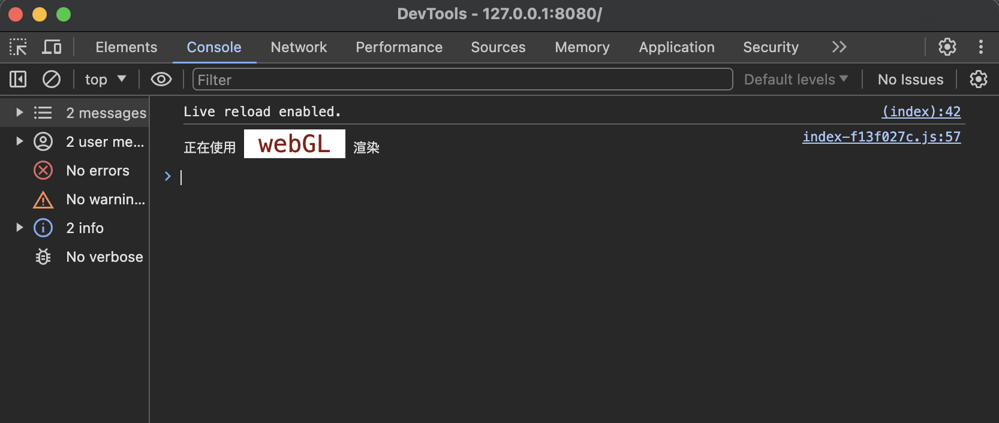
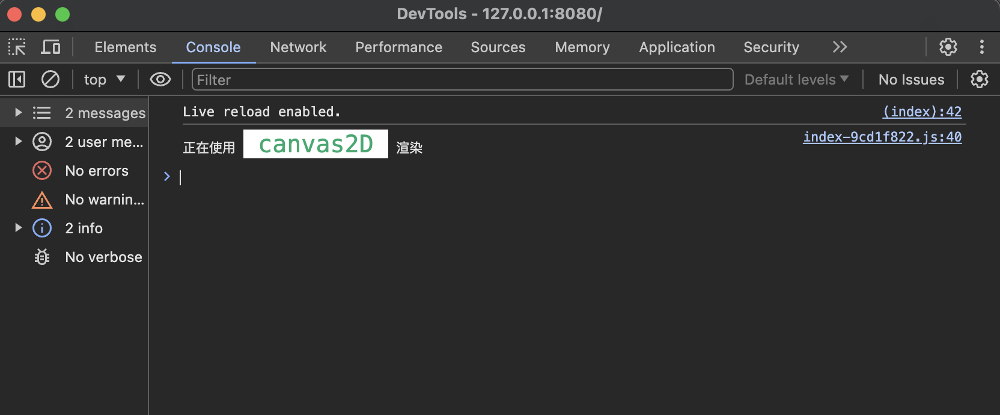

# 简介

这是一个canvas2D渲染引擎，目前支持canvas渲染和webGL渲染，其API命名跟pixijs version 7类似。主要的代码放在src/lib下，其余的代码都是一些测试代码。

# 启动项目

```bash
 yarn start
```

# 快速开始

```typescript
// 新建一个应用
// 首先需要有一个canvas元素
const view = document.getElementById('canvas') as HTMLCanvasElement

// new一个Application
const app = new Application({
  // 指定canvas元素
  view,
  // 指定背景颜色以及背景的透明度
  backgroundColor: '#aaaaaa',
  backgroundAlpha: 0.1
})

// 添加一个红色的矩形
const redRect = new Graphics().beginFill('red').drawRect(400, 300, 200, 200)
redRect.cursor = 'pointer'
app.stage.addChild(redRect)

// 添加一个绿色的圆
const greenCircle = new Graphics().beginFill('green').drawCircle(200, 400, 150)
greenCircle.cursor = 'pointer' // 添加指针悬浮效果
app.stage.addChild(greenCircle)

// 添加一个蓝色的多边形
const bluePoly = new Graphics()
  .beginFill('blue', 0.7)
  .moveTo(100, 200)
  .lineTo(400, 100)
  .lineTo(1000, 300)
  .lineTo(900, 600)
  .lineTo(800, 400)
  .closePath()
bluePoly.cursor = 'pointer'
app.stage.addChild(bluePoly)
```

然后就能在屏幕上看到效果了！

# 指定渲染方式

当前的默认渲染方式是webGL渲染，也可以显式地告诉渲染引擎使用何种渲染方式

```typescript
const app = new Application({
  prefer: 'webGL', // 这一行告诉渲染引擎要使用webGL渲染
  view,
  backgroundColor: '#aaaaaa',
  backgroundAlpha: 0.1
})
```

控制台会打印出当前的渲染方式：



也可以切换到canvas2D渲染：

```typescript
const app = new Application({
  prefer: 'canvas2D', // 这一行告诉渲染引擎要使用canvas2D渲染
  view,
  backgroundColor: '#aaaaaa',
  backgroundAlpha: 0.1
})
```


